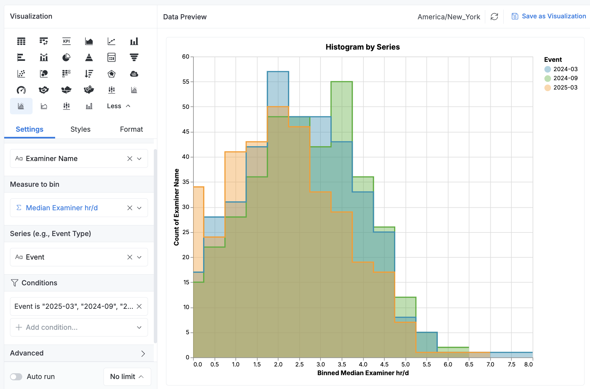

# Histogram: Multi-Series Comparison

This chart renders a histogram of a numeric field across multiple series, using step-interpolated **area charts**. It is ideal for comparing the **shape and distribution** of different categories or time slices.

---

## ✅ Features

- 📊 Step-area histogram using Vega-Lite
- 🔢 Configurable number of bins
- 🏷 Customizable chart title and axis labels
- 🎨 Per-series color encoding
- 🧱 Two comparison modes:
  - `"Stacked"`: Percent contribution by series (stacked area)
  - `"Overlay"`: Compare distributions side-by-side (overlaid areas)

---

## 📥 Fields

| Field    | Type                 | Description                                   |
| -------- | -------------------- | --------------------------------------------- |
| `grain`  | Dimension            | Entity to count (e.g. ID, Examiner Name)      |
| `metric` | Dimension or Measure | Numeric field to bin (e.g. hours/day)         |
| `series` | Dimension            | Category to group by (e.g. Event Type, Month) |

---

## 🧰 Options

| Option              | Type         | Default                     | Description                                             |
| ------------------- | ------------ | --------------------------- | ------------------------------------------------------- |
| `max_bins`          | number-input | `20`                        | Maximum number of histogram bins                        |
| `stack_bars`        | select       | `"none"`                    | `"stacked"` or `"none"` (overlay)                       |
| `render_as_percent` | toggle       | `false`                     | If enabled, stacks to 100% per bin (percent comparison) |
| `chart_title`       | input        | `"Histogram by Series"`     | Optional title override                                 |
| `x_axis_label`      | input        | `"Binned Value"`            | Custom X-axis label                                     |
| `y_axis_label`      | input        | `"Count"` or `"Percentage"` | Custom Y-axis label                                     |

---

## 📊 Output

Renders a normalized area chart with step interpolation. Each series is color-coded and optionally stacked or overlaid.

This chart is especially useful for:

- Comparing durations across phases or time periods
- Viewing distribution shifts over categories

## 🖼 Preview

---

## 📁 Files

- `README.md` — this file
- `vgl.aml` — the Holistics CustomChart spec

---

## 🧠 Notes

- The `"render_as_percent"` option overrides `stack_bars` and always uses `stack: "normalize"`.
- For a single-series histogram, use the [`histogram_chart`](../histogram_chart) version instead.
